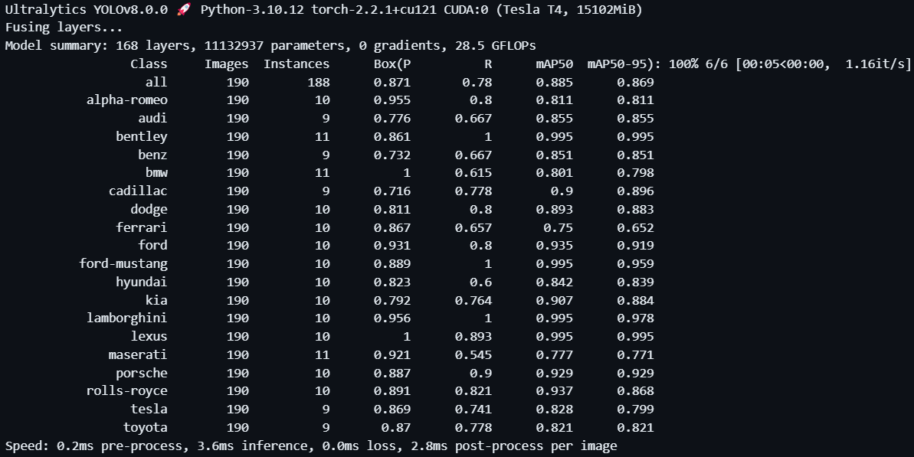

# Car-Brand-Detector
This is a computer vision app leveraging the power of state-of-the-art YOLO algorithm on a custom dataset to detect brands of cars in images. The app has been deployed using streamlit.

## Dataset
I downloaded a car brands dataset from Kaggle including images of 19 renowned car brands representing a mix of both high-end and mainstream manufacturers. 
Dataset Link: https://www.kaggle.com/datasets/alirezaatashnejad/over-20-car-brands-dataset

The dataset contains images of the following car brands:
1. Alpha Romeo
2. Audi
3. Bentley
4. Benz
5. BMW
6. Cadillac
7. Dodge
8. Ferrari
9. Ford
10. Ford Mustang
11. Hyundai
12. Kia
13. Lamborghini
14. Lexus
15. Maserati
16. Porsche
17. Rolls Royce
18. Tesla
19. Toyota

## Image Annotations
I took a sample of images from the dataset having 100 images from each car brand and annotated those images using roboflow - an image annotation tool.

## Model Training
I used the state-of-the-art object detection algorithm YOLOv8 and trained the model on my custom dataset on 100 epochs.

## Model Performance

### Overall Performance
The model achieves a high mean Average Precision (mAP50) of 0.885 and mAP50-95 of 0.869 for all classes combined. This indicates that the model performs well in accurately detecting objects across all classes at different IoU thresholds.
Precision and recall values for the combined classes (Box(P) and R) are 0.871 and 0.78 respectively, indicating a good balance between correctly identifying positive predictions (precision) and capturing all positive instances (recall).
### Individual Class Performance:
Each class has its own precision, recall, mAP50, and mAP50-95 values, which provide insights into the model's performance for each specific car brand.
Some classes achieve very high precision and recall values (close to or equal to 1.0), indicating excellent performance in detecting those particular car brands. For example, "bentley," "ford-mustang," "lamborghini," and "lexus" have high precision and recall values.
Other classes may have lower precision or recall values, indicating potential areas for improvement in the model's performance for those specific car brands. For example, "maserati" has a relatively low recall value of 0.545, indicating that the model may struggle to detect instances of this brand.
### Speed:
The model inference speed is reported as 3.6 milliseconds per image, which indicates a relatively fast processing time for object detection tasks.

In summary, based on these validation results, we can deduce that the model performs well overall, achieving high precision, recall, and mAP values for most classes. However, there may be some variability in performance across different car brands, suggesting potential areas for further optimization or fine-tuning of the model.
